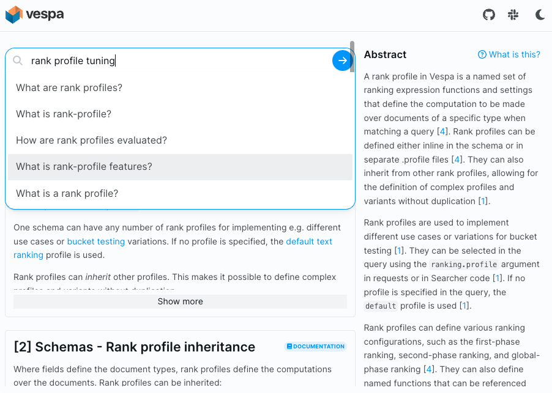

<!-- Copyright Yahoo. Licensed under the terms of the Apache 2.0 license. See LICENSE in the project root. -->

# Vespa Search
This is a Vespa Application for searching and exploring documentation, blogs,
sample applications and other resources useful when working on Vespa.

<!-- ToDo: Link to Blog post announcement when published -->

Install and start:

    $ yarn install
    $ yarn dev                # then open link, like http://127.0.0.1:3000/

Alternatively, use Docker to start it without installing node:

    $ docker run -v `pwd`:/w -w /w --publish 3000:3000 node sh -c 'yarn install && yarn dev --host'

When started, open [http://127.0.0.1:3000/](http://127.0.0.1:3000/).
